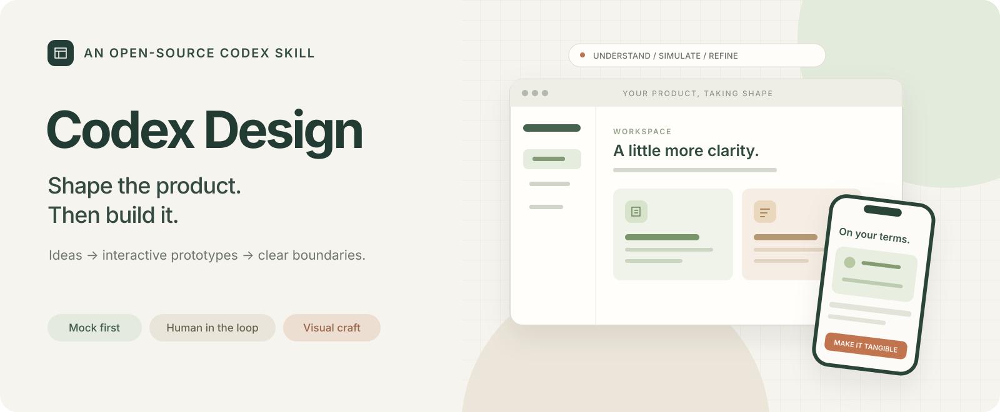
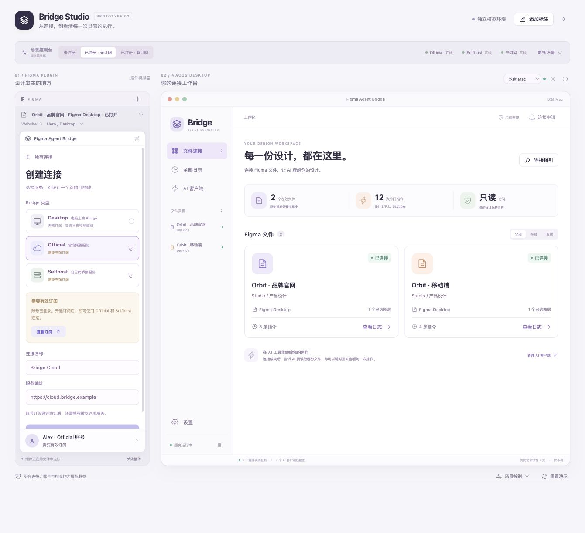

<p align="center">
  
</p>

<p align="center">
  <a href="https://github.com/BppleMan/codex-design/actions/workflows/validate.yml"></a>
  <a href="LICENSE"></a>
  
  
  
</p>

<p align="center"><a href="README.md">English</a> · <strong>简体中文</strong></p>

# Codex Design

**把想法变成高保真可交互原型，再通过原型共同定义产品。**

Codex Design 是一个 **Codex Skill**，用于理解意图、分轮追问、构建 mock 体验，并让用户在浏览器中持续参与完善。核心交付是有真实操作依据的产品定义。

起点可以是一个火花、一个问题、已有原型或代码。不要求完整 PRD、现有仓库、特定模型、思考档位或前端技术栈。

本仓库提供工作指令、参考资料和产品定义模板，**不包含可直接运行的原型或 starter app**；Skill 会指导 Codex 为你的产品建立独立 Web 项目。

## 工作方式

用户参与贯穿全过程。按产品当前成熟度进入工作，保留已经确定的决定。

1. **吃透意图。** 确认受众、问题、使用情境与预期结果。存在相关实现时，针对性查看，并区分当前实现、用户期望和待确认假设。
2. **分轮 grill-me。** 每轮围绕重要行为和取舍提出少量问题，再用回答决定下一轮。使用当前模式允许的同步原生提问工具，并等待答案返回；如果不可用，就在聊天中提问，等待用户下一轮回复。
3. **构建单个 Web 原型。** 在一个项目中模拟所需的 Web、macOS、iOS、Android、插件或其他宿主界面。可以只有一个模拟器；有关联的模拟器共享 mock 状态。场景控制放在模拟产品之外。
4. **一起评审与精调。** 在 Codex 内置浏览器运行原型，使用其内置批注功能，按反馈做明确修改。显式比较配色、排版、密度、层级和关键状态，同时保留用户已认可的部分。
5. **持续形成产品定义。** 随原型更新范围、对象关系、权限、流程、恢复行为、视觉决定和未解决假设。
6. **按要求启动业务转译。** 用户确认版本并明确要求实施后，将页面、组件、状态和行为对应到目标应用，用相同场景进行对照。

“1:1”既包括布局与视觉，也包括交互和状态规则。必要的平台差异应明确说明。

## 交付内容

- 可运行的独立 Web 原型，以及前后一致的 mock 交互。
- 可复现的相关场景，例如空数据、不同身份、时延、失败和恢复。
- 简洁且持续更新的产品定义，需要时使用[模板](assets/product-definition.template.md)。
- 视觉决定与浏览器验证证据，明确区分已验证行为、待用户评审和假设。
- 用户要求正式实施后：范围明确的转译计划，以及与确认原型的对照。

Skill 不会在你的产品中另建批注系统。当前环境缺少内置浏览器批注时，使用文字或截图位置承接反馈，并说明该限制。

## 安装

需要能够加载本地 Skill 的 Codex 环境、创建并运行本地 Web 项目的权限，以及适用的前端工具。浏览器评审使用当前环境实际提供的浏览器能力。

**先检查目标目录。** 如果目录已经存在，检查其内容和安装方式，不要覆盖。仅在目标目录尚未使用时运行：

```sh
git clone https://github.com/BppleMan/codex-design.git "${CODEX_HOME:-$HOME/.codex}/skills/codex-design"
```

仓库根目录就是 `SKILL.md` 所在位置，无需复制内部子目录。在已加载该 Skill 的 Codex 会话中使用 `$codex-design`。

如果当前环境提供 Skill 安装器，也可以直接提出：

> 从 https://github.com/BppleMan/codex-design 安装这个 Codex Skill。SKILL.md 位于仓库根目录。

### 更新 Git 安装

仅适用于目标目录确实是本仓库 Git 克隆的情况。先检查工作区：

```sh
git -C "${CODEX_HOME:-$HOME/.codex}/skills/codex-design" status --short
```

只有工作区干净时才运行：

```sh
git -C "${CODEX_HOME:-$HOME/.codex}/skills/codex-design" pull --ff-only
```

如果存在本地改动，或 Git 无法快进更新，先检查并保留这些工作，再处理更新。

## 使用示例

**从一个想法开始**

> 使用 $codex-design。我想帮助自由设计师追踪客户反馈。先理解问题，分轮 grill-me，再构建 mock 原型供我们一起评审。本轮不接真实后端。

**继续已有原型**

> 使用 $codex-design 继续这个原型。保留已经确认的决定，检查流程遗漏，追问重要取舍。让我在内置浏览器中操作修改后的界面，并通过批注继续调整。

**从确认原型转入正式实现**

> 我确认原型 v3 中的首次使用和账号设置流程。使用 $codex-design 开始将这些流程转译到现有应用。保留布局、视觉层级、交互和状态行为；验证相同场景，并指出必要的原生平台差异。

## 实际案例



Bridge Studio 通过联动的 mock 模拟器逐步明确连接、身份、权限和生命周期行为。[案例记录](references/lessons-from-bridge-studio.md)说明了可迁移的方法及其边界。

这是历史原型示例，不是随仓库附带的应用，也不是通用布局模板。截图中如出现自制批注控件，属于较早实现；本 Skill 要求使用 Codex 内置批注。

## 能力边界

- Mock 行为不能证明真实 API、网络、认证、支付或原生宿主中的行为。
- 浏览器检查、用户设计确认和生产验收是不同的阶段。
- 视觉精调是明确的工作，不代表沿用统一配色，也不要求重做用户已经认可的设计。
- 用户明确要求后，才按已确认范围开始业务接入。
- Skill 不承诺固定生成速度，也不要求特定模型。

## 仓库导航

| 路径 | 用途 |
| --- | --- |
| [SKILL.md](SKILL.md) | Skill 工作指令与范围边界 |
| [agents/openai.yaml](agents/openai.yaml) | 展示信息与建议调用方式 |
| [references/discovery.md](references/discovery.md) | 意图理解与分轮提问 |
| [references/visual-and-browser-review.md](references/visual-and-browser-review.md) | 视觉精调与浏览器评审 |
| [references/lessons-from-bridge-studio.md](references/lessons-from-bridge-studio.md) | 案例证据、反例与限制 |
| [assets/product-definition.template.md](assets/product-definition.template.md) | 产品定义模板，不是应用脚手架 |
| [scripts/validate.py](scripts/validate.py) | 仓库校验 |
| [tests/](tests/) | 校验器测试 |

## 开发与贡献

```sh
python3 -m pip install -r requirements-dev.txt
python3 scripts/validate.py
python3 -m unittest discover -s tests
```

这些检查验证 Skill 仓库本身，不能代替生成原型的浏览器评审。贡献方式见 [CONTRIBUTING.md](CONTRIBUTING.md)。

## 许可证与致谢

采用 [Apache-2.0](LICENSE) 许可证。这是由 [BppleMan](https://github.com/BppleMan) 维护、源于 Bridge Studio 原型实践的独立社区项目，并非 OpenAI 官方项目。
