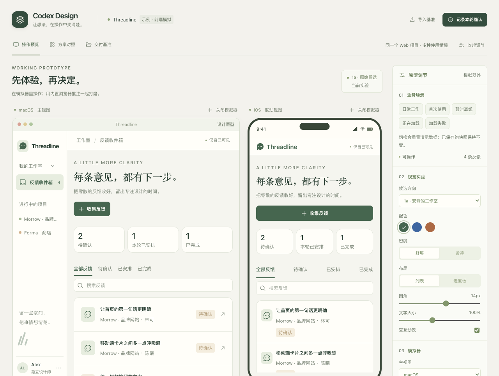

# Cases and demonstrations / 案例与演示

These are optional background materials, not the starting point for using Codex Design. Describe your own idea first; the product model, visual direction, and host setup are designed for that goal. Neither example is a default product template.

这些内容是可选的背景资料。使用 Codex Design 时从你自己的想法开始，业务模型、视觉方向和宿主组合都围绕你的目标设计；以下案例不是默认产品模板。

## Workflow demonstration / 工作机制演示

Threadline is a fictional feedback inbox used to demonstrate shared mock state, visual comparisons, scenario controls, and baseline export/restore. Its interview answers are illustrative assumptions, not real user decisions. The reusable part is the workbench mechanism; replace the example business and design when building a different product.

Threadline 是虚构的反馈收件箱，用来演示共享状态、视觉比较、场景控制和基准导出还原。访谈回答是演示假设；复用的是工作台机制，实际产品需要重新设计业务和视觉。

[Walkthrough / 演示路径](../examples/feedback-inbox.md) · [Developer starter guide / 开发者底座指南](../references/prototype-workbench.md) · [Verification record / 验证记录](starter-verification.md)

## Practice notes / 实践记录

Bridge Studio used linked plugin and desktop simulators to clarify connections, identities, permissions, and lifecycles. Its domain, two-panel layout, and palette belong to that project. The historical screenshot may include early custom annotation controls; Codex Design uses the built-in browser's annotations.

Bridge Studio 通过联动的插件和桌面模拟器明确连接、身份、权限与生命周期。业务、双栏和配色都属于该项目。历史截图可能包含早期自制批注控件；Codex Design 使用内置浏览器批注。

[Transferable lessons and limits / 可迁移的方法及边界](../references/lessons-from-bridge-studio.md)
